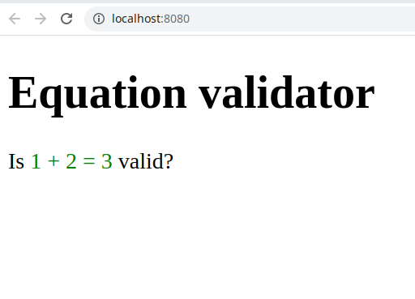
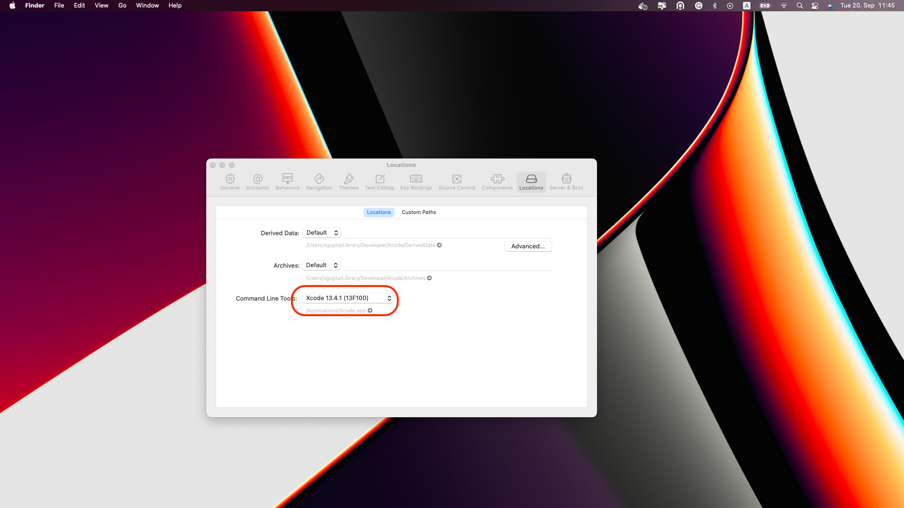
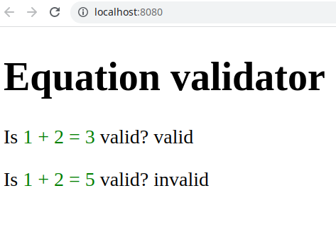

# ReactJS/TypeScript and Kotlin assignment

This repo is used for home assignment as part of the hiring process at Bettermarks.

We hope that you would be able to finish this assignment within two hours. 

**If there are any questions/problems while you are working on it, please ask them via mail or create an issue in the repo.**

**Objective**: Create a small equation validator web application using Kotlin, ReactJS and TypeScript.

## Requirements

- OpenJDK 18
- Kotlin SDK
- NodeJS v16

## Step 0 - Run the code

- The `app` folder contains the ReactJS and TypeScript code base
- The `equation-validator` folder contains the Kotlin code base

- In the `app` folder, make sure the react app is running correctly:

```sh
node -v
# > v16
npm i && npm start
```

Your app should run on [localhost:8080](http://localhost:8080)


- In the `equation-validator` folder
  - build the kotlin app:

    ```sh
    java --version
    # > openjdk 18 ....
    ./gradlew build
    ```

  - run the kotlin app using the native CLI executable:

    ```sh
    ./build/bin/native/debugExecutable/equation-validator.kexe
    # > Enter an equation (like a + b = c):
    # > 1 + 2 = 3
    # > FIXME
    ```
### Trouble shooting Step 0 for M1 Macbook
- Ensure that you have XCODE and it is corresponding CLI tools installed with `xcode-select --install`
- If you still get the error, perform the following steps.
- Launch XCode and open preferences as shown in the screenshot.
- Make sure in the Command line tools, there is a selection for "XCode"
- 
## Step 1 - Kotlin: implement the equation validator

- **Objective**: Given a text input representing a simple equation, return if the equation is valid or not.

**Only equations of type `a + b = c`** are accepted.

Examples:
```plain
Input: "1 + 2 = 3"
Response: "valid"

Input: "1 + 2 = 5"
Response: "invalid"

Input: "not an equation"
Response: "syntax error"

Input: "1 + 2 + 3 = 6"
Response: "syntax error"

Input: "1 - 2 = 3"
Response: "syntax error" 
```

You can code your validator inside `equation-validator/src/commonMain/kotlin/Validator.kt`

## Step 2 - React: Integrate the validator JavaScript library

- **Objective**: Use the equation validator from the ReactJS/TypeScript app.

The gradle configuration is already configured to build the `equation-validator` as JavaScript bundle in `equation-validator/build/js/packages/equation-validator`

- You can include the `equation-validator` module like:
```sh
# from app/
npm i --save ../equation-validator/build/js/packages/equation-validator
```
- and `import {validateEquation} from 'equation-validator';` to import the equation-validator (compiled from the `fun validate() { ... }` in kotlin)

- You do not need any specific style, just add the return of the `validateEquation` function inside a `<span></span>` html tag after the `?`



## Step 3 - Submit your results

1. Commit and push all your changes to a new branch
1. Create a pull request on main with your results from GitHub In case you ar not familiar with creating pull requests, please follow [the official instructions provided by GitHub](https://docs.github.com/en/pull-requests/collaborating-with-pull-requests/proposing-changes-to-your-work-with-pull-requests/creating-a-pull-request).
1. Add your contact person as a reviewer.


